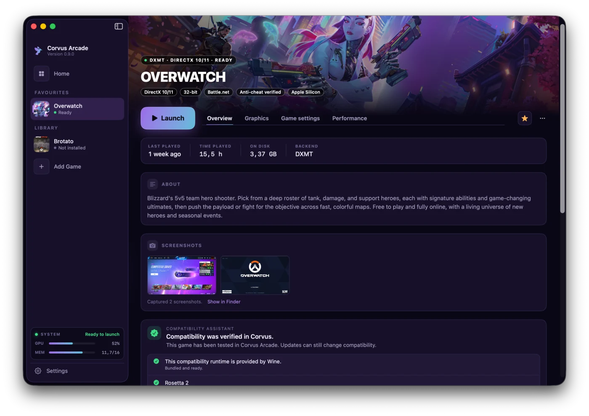
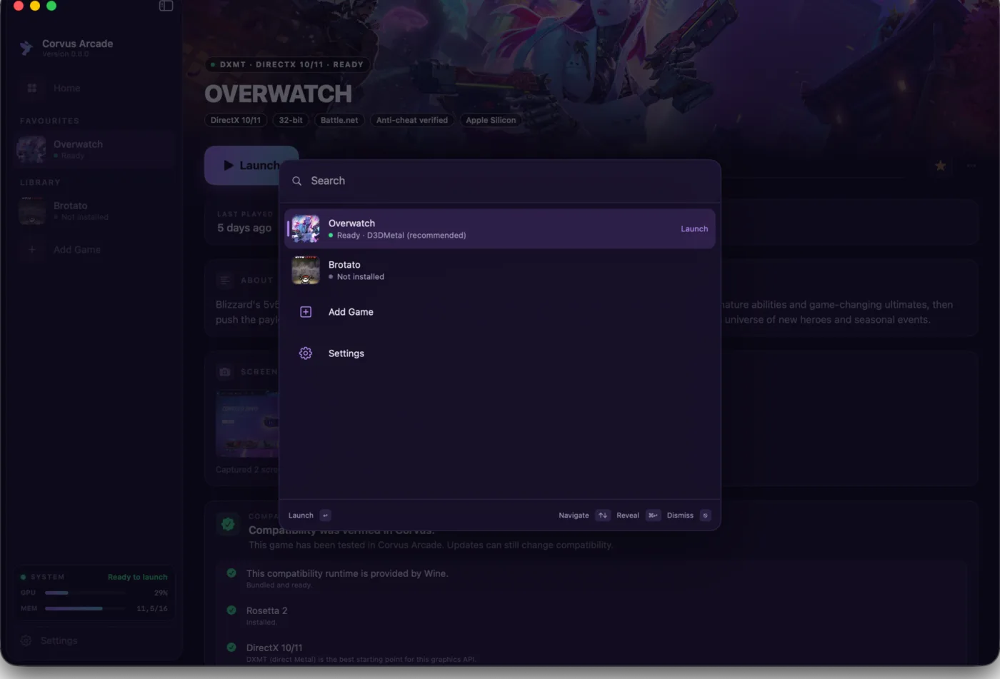
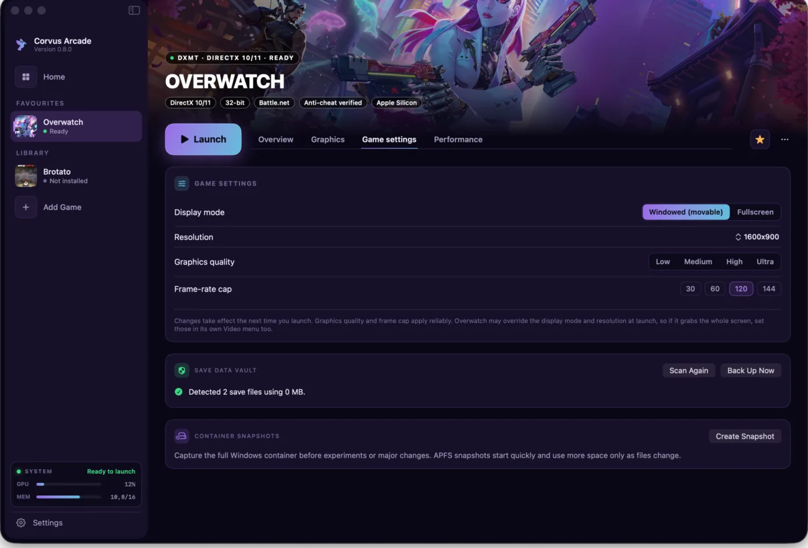
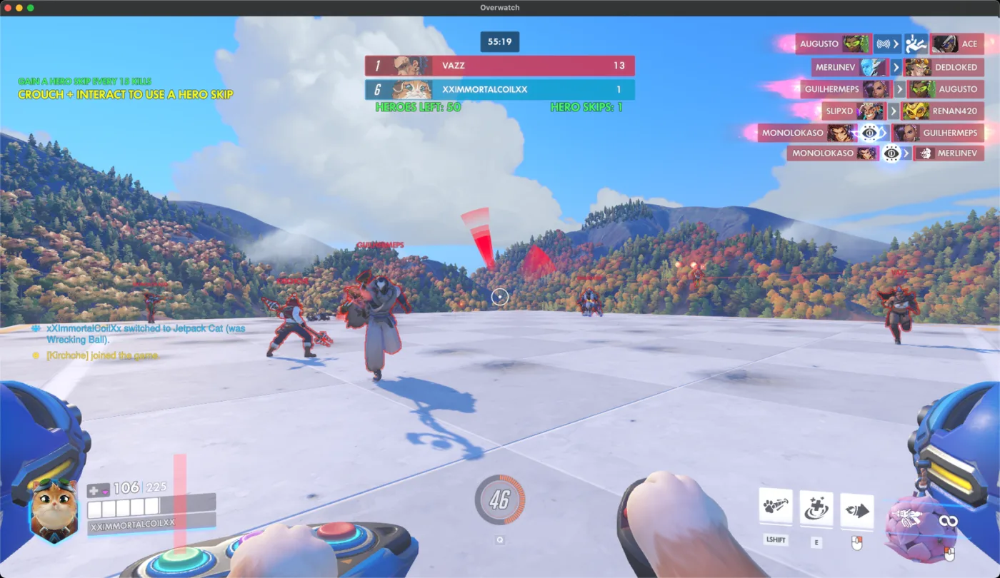
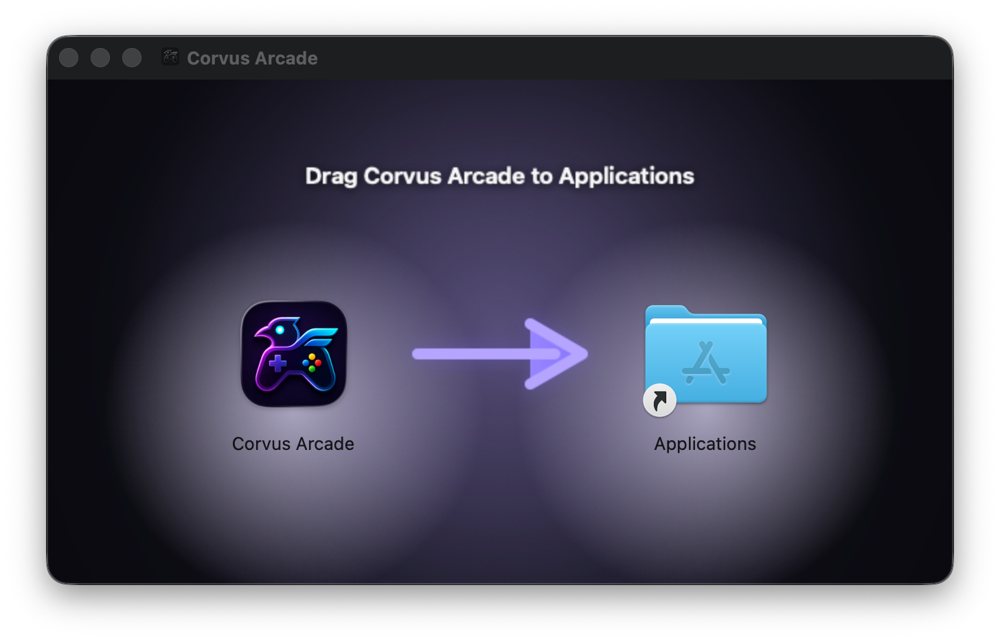

# Corvus Arcade

**Windows games, at home on Mac.**

A native launcher for running selected Windows games on Apple Silicon. Corvus Arcade bundles its own Wine-based compatibility runtime, guides setup, and keeps tuning, diagnostics, saves, and updates in one Mac app.

[**Download the latest release**](https://github.com/CorvusDevs/CorvusArcade/releases/latest) &nbsp; [**Explore the website**](https://corvusdevs.github.io/CorvusArcade/)

Free to download. No account. No analytics. macOS 26 or later.

## Play, tune, protect

| Play | Tune | Protect |
|---|---|---|
| Add a supported game, let Corvus build its container, and launch it from a native library. | Choose DXMT or D3DMetal, select a GPTK generation, and adjust graphics and window behavior per game. | Back up detected saves and create APFS container snapshots before experimenting. |

<table>
  <tr>
    <td width="50%"></td>
    <td width="50%"></td>
  </tr>
  <tr>
    <td align="center">Find games and actions instantly with Command-K.</td>
    <td align="center">Keep recovery tools close without crowding the main game view.</td>
  </tr>
</table>

  
   Overwatch running in a macOS window. Open the image at full resolution.

## New in 0.9.0

- **Game support files.** Install common dependencies through guided, reusable repair recipes.
- **Compatibility Assistant.** See readiness checks, likely blockers, and recommended fixes before launch.
- **Steam library sync.** Discover eligible games from an existing Steam library.
- **Spotlight launch.** Open installed games directly from macOS Spotlight.

[Read the complete 0.9.0 release notes](https://github.com/CorvusDevs/CorvusArcade/releases/tag/v0.9.0)

## Install

1. Download the latest `.dmg` from [GitHub Releases](https://github.com/CorvusDevs/CorvusArcade/releases/latest).
2. Open the disk image.
3. Drag Corvus Arcade onto Applications.
4. Open Corvus Arcade and follow the guided setup for your game.

  
   The actual 0.9.0 installer window.

Every release is signed with an Apple Developer ID and notarized by Apple. You can also verify the published files with the release's [SHA256 checksums](https://github.com/CorvusDevs/CorvusArcade/releases/download/v0.9.0/SHA256SUMS.txt).

## Compatibility expectations

Corvus Arcade is a compatibility launcher, not a promise that every Windows game will run. Game updates, anti-cheat systems, launchers, and graphics APIs can change compatibility at any time.

- Apple Silicon Mac, M1 or newer
- macOS 26 or later
- macOS 26.4 or later for the GPTK 4 backend
- Rosetta 2, which Corvus Arcade can install when missing
- Enough free storage for the game and its Windows container

Start with the app's recommended backend. Use the Compatibility Assistant before changing advanced options. If a game fails, submit a [game compatibility report](https://github.com/CorvusDevs/CorvusArcade/issues/new?template=game-compatibility.yml) with the diagnostics requested by the form.

## What Corvus Arcade includes

- Native SwiftUI library, search, favourites, sorting, custom artwork, and desktop shortcuts
- Curated one-click setup for Overwatch through Battle.net
- Experimental support for your own Windows installers and executables
- DXMT and Apple D3DMetal graphics backends
- GPTK 3 or GPTK 4 selection per game
- Windowed play, frame cap, MetalFX, FPS overlay, and screenshots
- Save Data Vault, APFS container snapshots, repair, cleanup, reset, and disk usage tools
- Multi-part installer validation and live installer progress
- Automatic app updates through Sparkle

## Trust and project scope

Corvus Arcade runs locally. It has no account system, analytics, telemetry, or advertising. Network access is used only for user-requested downloads, update checks, public artwork, and game launcher traffic.

The compatibility stack includes Wine, DXMT, Apple Game Porting Toolkit components, Rosetta 2, and Sparkle. Their own licenses and terms apply. Third-party notices are included with the app. Corvus Arcade is not affiliated with Apple, Blizzard, CodeWeavers, Microsoft, or Valve.

This public repository intentionally contains documentation, the website, release downloads, checksums, and issue tracking. The application source is maintained privately and is never published here.

## Help and reporting

- [Installation and troubleshooting help](SUPPORT.md)
- [Report a Corvus Arcade bug](https://github.com/CorvusDevs/CorvusArcade/issues/new?template=bug-report.yml)
- [Report game compatibility](https://github.com/CorvusDevs/CorvusArcade/issues/new?template=game-compatibility.yml)
- [Report a security issue privately](SECURITY.md)
- [Browse releases](https://github.com/CorvusDevs/CorvusArcade/releases)

## More from CorvusDevs

[Corvus Display](https://corvusdevs.github.io/CorvusDisplay/) · [Corvus Player](https://corvusdevs.github.io/Corvus-Player/) · [Ekual](https://corvusdevs.github.io/Ekual/) · [Corvus RSS Reader](https://corvusdevs.github.io/Corvus-RSS-Reader-For-Safari/) · [Purple Crow for Safari](https://corvusdevs.github.io/Purple-Crow-For-Safari/)

Made by <a href="https://corvusdevs.github.io">CorvusDevs</a>

